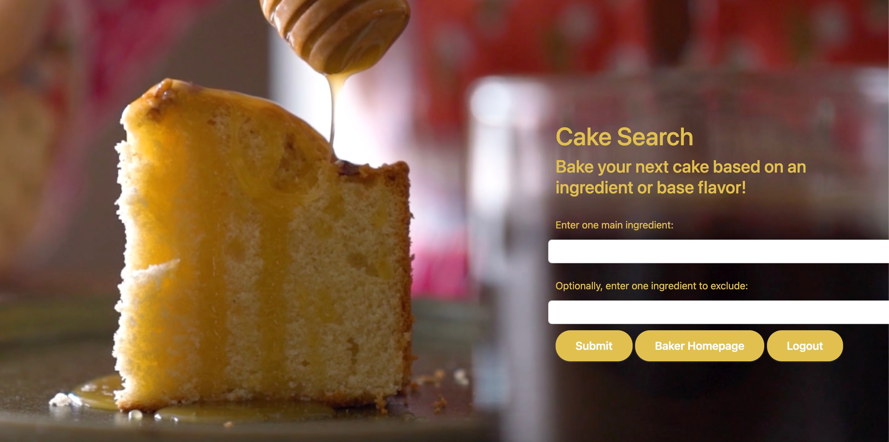

CAKE BAKE

This niche fullstack web application is for those who love to bake cakes.  In the mood to bake, but need a recipe for those apricots from the farmers market?  Cake Bake will do the searching for you so you have some choices.  What about your almond allergy?  Cake Bake will only give you recipes with no almonds!
You can save as many recipes to your own personalized recipe box. Add and delete.  Leave notes or a review.  The icing on the app?  Your own trivia button full of cake facts from around the world and ages!

Cake Bake utilizes the following stack to help you with your cake obession:

A SQL database with seperate table and class for user information and favorite recipes to query

SQLAlchemy

JSON

Flask (Python)

AJAX

Jinja2  using template inheritance across all pages

Vanilla JavaScript to manipulate the DOM

HTML

CSS

Bootstrap 

Edaman API - Recipe Search
https://developer.edamam.com/edamam-docs-recipe-api

Cake Bake 2.0 plans:

Kroger API to search for ingredients near your location 
https://developer.kroger.com/documentation/public/getting-started/quick-start

Google Map API for directions
https://developers.google.com/maps/documentation

Search function for recipes in Recipe Box

Recipe Box results expansion on page

Multiple timers for your baking

Music while you bake: Link to YouTube for LoFi music videos / Spotify / Apple Music playlists

Rotating Homepage cake images

Your cake personality quiz - If you were a cake, what kind of cake would you be?

## **INSTALLATION:**

To run the app on your computer, please follow these steps:

CLONE REPOSITORY:

$ git clone https://github.com/Pau1een/Cake-Bake

CREATE AND ACTIVATE A VIRTUAL ENVIRONMENT:

   $ pip3 install virtualenv  
   $ virtualenv env  
   $ source env/bin/activate  

INSTALL DEPENDENCIES:

(env) $ pip3 install -r requirements.txt

CREATE DATABASE:

(env) $ createdb cake

CREATE DATABASE TABLES:

  (env) $ python3 -i model.py  
  db.create_all()  

START BACKEND SERVER:

(env) $ python3 server.py

## **YOUTUBE VIDEO:**

See link under "About" on, https://youtu.be/k8Pv97TwN3Y